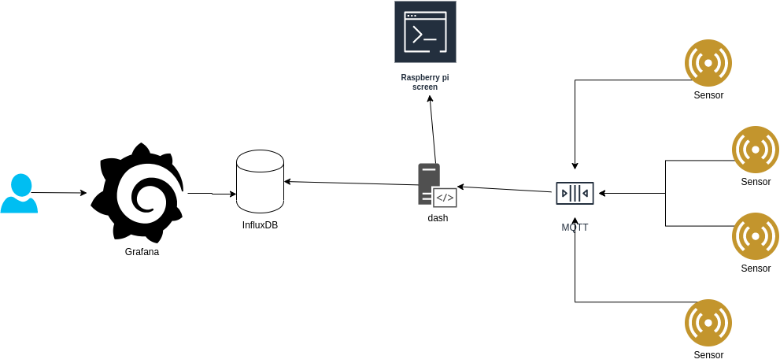

## Overview

This repository contains everything related to the Industrial data logger suitcase, including Raspberry Pi configuration in `ansible/`, firmware for actual devices (`espBME280/`, `espButton` ... ) and `dash/` which glues a lot of stuff together.

## Concept drawing


Data flows from sensors, though MQTT where `dash` listens for events which it then passes on to the GUI of the Raspberry Pi and stores it in the database.
 
Users access a Grafana frontend where they will be able to browse time series data directly from the database.
All the above software runs locally on the Raspberry Pi

## Connectivity
Raspberry Pi(s) continuously tries to join a VPN with our cloud server - the cloud server acts as a reverse proxy and passes HTTP requests for configured domains directly to the Raspberry Pis inside the VPN. Traffic not inside the VPN and also not directly connected to the Pi's wifi network will be rejected.

## Firmware over-the-air updates
The OTA scheme implemented tries to solve two scenarios
* A developer sits in platformio and wants to update all BME280 sensor devices
* A case is pulled out - some BME280 sensors are updated, some are not - those that are not should be able to update themselves without anyone touching the IDE

To solve these scenarios, the `dash/` projects host simple JSON files describing the latest version of a given firmware type - When a device cold boots, it will try to compare its release to the one fetched from `dash`.

When a developer wants to upload new firmware, `idlversion` and `idluploader` helps figuring out what version number to use next, when running "Upload" it will upload the firmware to the IDL case and publish a message on MQTT which devices listen to. Devices then to the regular OTA update just as if hey where cold booted.

## BOM
Raspberry Pi
Raspberry Pi display
4G GSM dongle
esp32 devices and sensors

## MQTT namespaces and Datatypes
Two high-level namespaces exist at the moment, `idl` and `idlota`

### /idl/<deviceID>/<messageType>
Used for incoming events and metrics, `dash` assumes data is metric by default. `<deviceID>`, is used to tag the data and `<messageType` is dictating the format of the json payload. Two message-type formats exists, `events` and `measurements`. Common for both formats is the massages are in an array with an object for each measurement and event. Be aware that the formats does not mix. One array must contain only one format type chosen by the MQTT toppic

**Examples of Metric topics and their payloads:**
```
/idl/C4B3CC/measurements
[
    {       
        "table": "temperature", // influxdb tabel
        "name": "sensor 1", // influxdb tag
        "unit": "celcius", // influxdb tag
        "value": 23.34, // influxdb value
    },
]
```
**Event message**
```
/idl/1C8781/events
[
    {       
        "table": "events", // influxdb tabel
        "msg": "someove pushed the red button", // human readable ish
        "payload": "{blob}", // whatever one sees fit
        "tags": { 
            "color":"red",
            "priority": "1",
        }
    },
]
```
**Multiple measurements**
```
/idl/deviceId/measurements
[
    {       
        "table": "microphone",
        "name": "sensor1",
        "unit": "dBm",
        "value": 23.34,
        "tags": { 
            "band":"100hz",
        }
    },
    {       
        "table": "microphone",
        "name": "sensor1",
        "unit": "dBm",
        "value": 23.34,
        "tags": { 
            "band":"100hz",
        }
    },
    {       
        "table": "microphone",
        "name": "sensor2",
        "unit": "dBm",
        "value": 23.34,
        "tags": { 
            "band":"100hz",
        }
    },
    {       
        "table": "microphone",
        "name": "sensor2",
        "unit": "dBm",
        "value": 23.34,
        "tags": { 
            "band":"100hz",
        }
    },
]
```


### /idlota topics
These topics are used to announce firmware updates to running devices. There is no payload and publishes to this topic makes sure interested devices check the OTA service for updates.

## Legal
Copyright 2020 Aalborg University
MIT License
